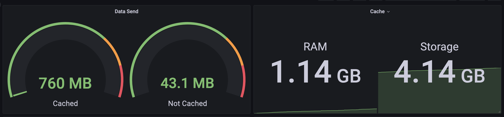

[](https://hub.docker.com/repository/docker/i5heu/bonito-cache)
[](https://hub.docker.com/repository/docker/i5heu/bonito-cache)
[](https://wakatime.com/badge/github/i5heu/bonito-cache)

<p align="center" style="margin: 2em;">
  
</p>


# bonito-cache
This simple cache can greatly reduce the bandwidth and requests costs of a S3 Bucket or any other public backend storage, if this cache is used from a cheap server provider like Hetzner.  

You can simply configure how much RAM and file storage you want to allocate to cached files (e.g. 20GB RAM and 1TB storage). The cache will then automatically delete the least recently used files to free up space if the cache is full.  

Detailed statistics can be optionally written to a InfluxDB to monitor the cache usage and performance.  

All this is can be done very simple with a few environment variables.  

On my mastodon instance i can reduce the bandwidth costs by a whopping 95% with bonito-cache.



#### Name
The bonito is one of the fastest fish in the ocean (60Km/h?). It is also a type of tuna. The name is a reference to the speed of the cache.

## Status
The project is working in its current state. It is not feature complete, but it is usable.
The code needs some cleanup, refactoring and most importantly tests.

## Available Environment Variables
* `BONITO_S3_ENDPOINT` - The endpoint of your S3 bucket. Defaults to `https://localhost`
* `BONITO_CORS_DOMAIN` - The domain to allow CORS requests from. Defaults to `https://example.com`
* `BONITO_USE_MAX_RAM_GB` - The maximum amount of RAM to use for caching. Defaults to `2` GB
* `BONITO_USE_MAX_DISK_GB` - The maximum amount of disk space to use for caching. Defaults to `25` GB
* `BONITO_STORAGE_PATH` - The path to store cached files. Defaults to `/cache`
* `BONITO_INFLUXDB_URL` - OPTIONAL The URL of your InfluxDB instance. Defaults to `""`
* `BONITO_INFLUXDB_TOKEN` - OPTIONAL The token to use for authentication with InfluxDB. Defaults to `""`
* `BONITO_INFLUXDB_ORG` - OPTIONAL The organization to use for authentication with InfluxDB. Defaults to `""`
* `BONITO_INFLUXDB_BUCKET` - OPTIONAL The bucket to use for authentication with InfluxDB. Defaults to `""`

Note: InfluxDB is only used for statistics and is optional to configure.

## Docker Compose Example
```yaml
version: "3.7"
services:
  ss3c:
    image: i5heu/bonito-cache:latest
    container_name: ss3c
    restart: always
    environment:
      - BONITO_S3_ENDPOINT=https://cdn.example.com
      - BONITO_CORS_DOMAIN=https://example.com
      - BONITO_USE_MAX_RAM_GB=5
      - BONITO_USE_MAX_DISK_GB=50
      - BONITO_INFLUXDB_URL=http://influxdb.example.com:8086
      - BONITO_INFLUXDB_TOKEN=super-cool-token-iahfpwihg9h32ithowh
      - BONITO_INFLUXDB_ORG=super-cool-org
      - BONITO_INFLUXDB_BUCKET=super-cool-bucket
    ports:
      - 8080:8084
    volumes:
      - ./cache:/cache
```

## Docker Hub
https://hub.docker.com/repository/docker/i5heu/bonito-cache

## TODO for 1.0.0
- Add a CLI and API to delete a cached file
- refactor code
- build better docs
- rename project

## Future features
Caching in cluster mode.  
If you build a cluster of bonito-cache instances, they will try to request a file from each other first before requesting it from the S3 bucket.  

## License
bonito-cache © 2022 Mia Heidenstedt and contributors   
SPDX-License-Identifier: AGPL-3.0  
